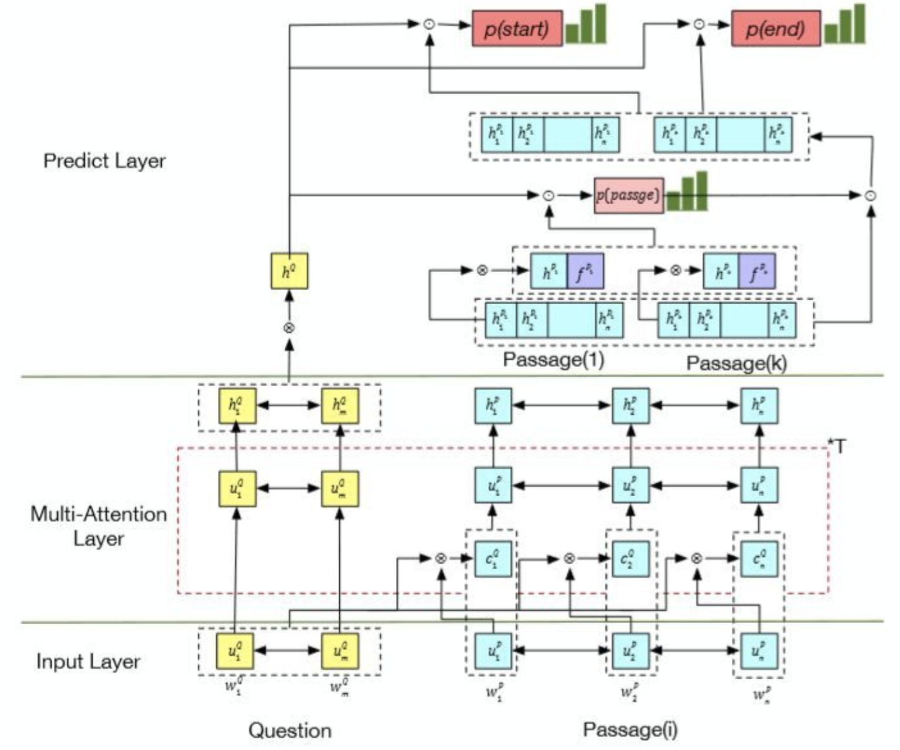
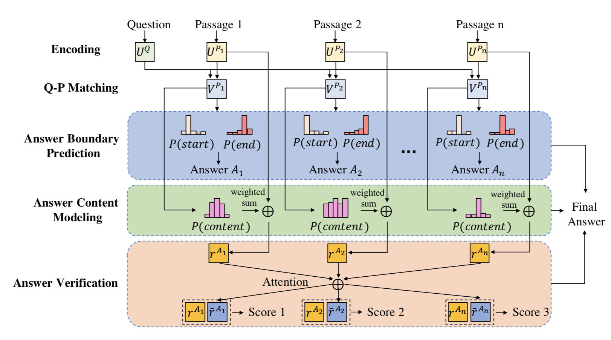
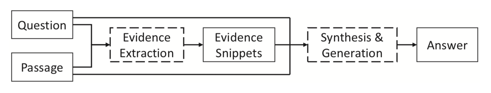
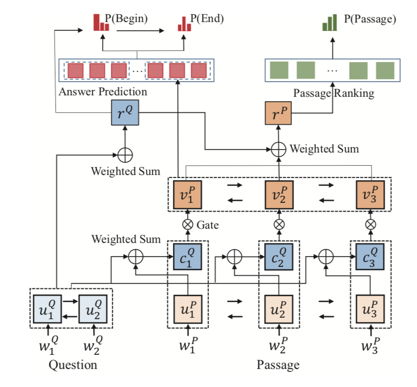
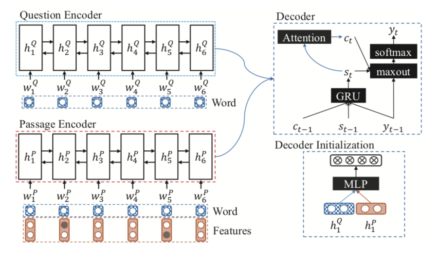
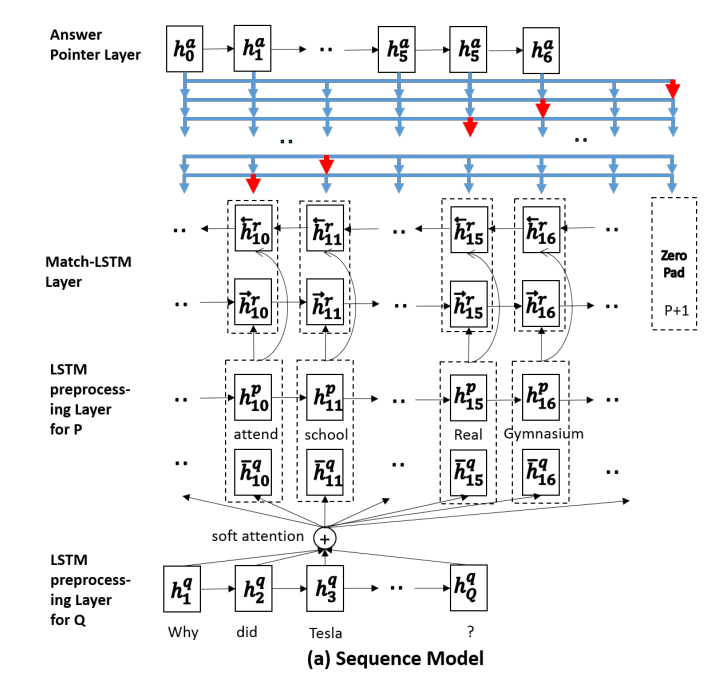
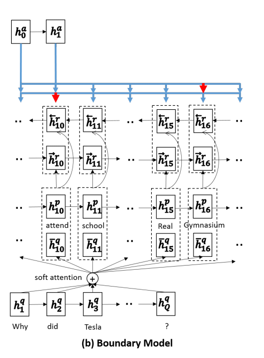
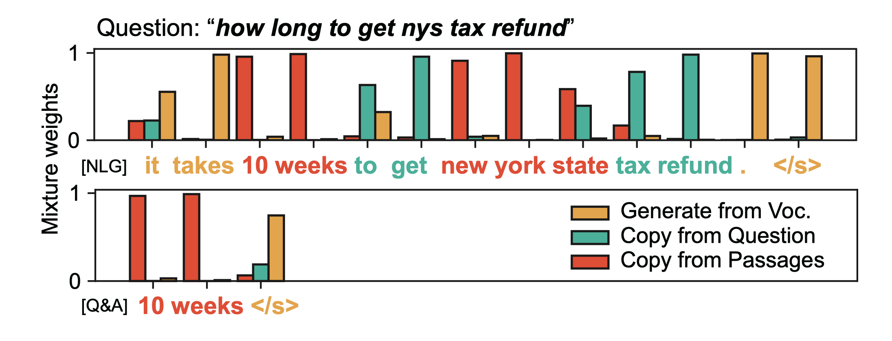
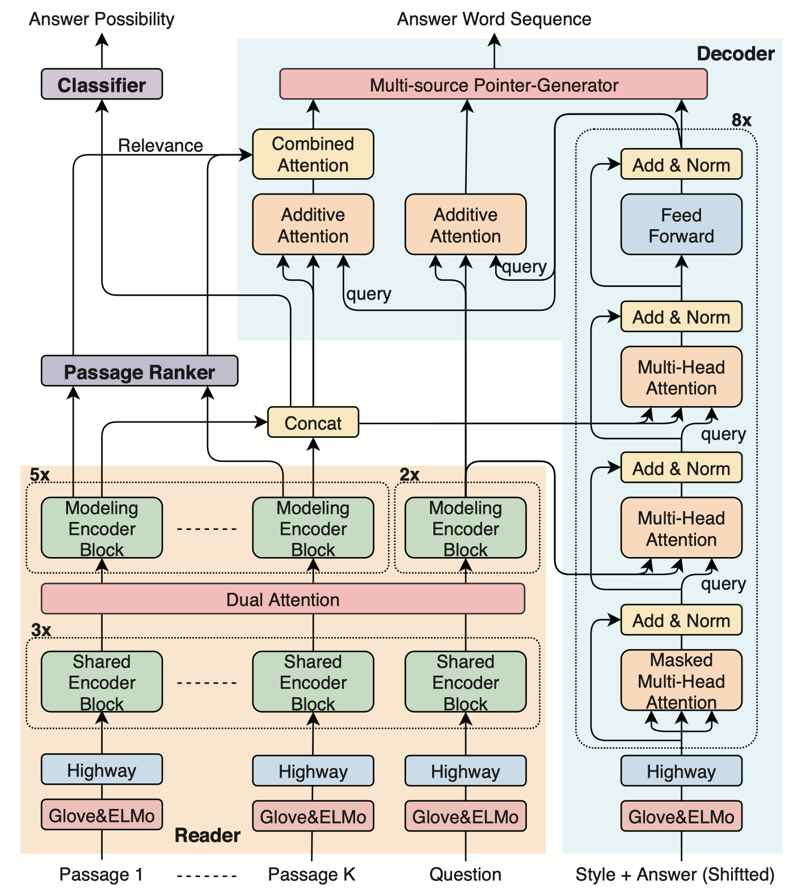
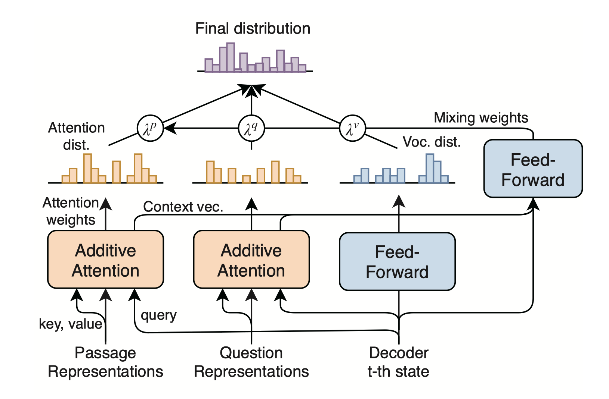

# Analysis on MS MARCO leaderboard

Analysis on the MS-MARCO [leaderboard](http://www.msmarco.org/leaders.aspx), including V1 and V2, regarding the machine reading comprehension task.

Contributed by Yuqiang Xie, Luxi Xing and Wei Peng, *National Engineering Laboratory for Information Security Technologies, IIE, CAS*.

***Unfortunately, MS MARCO's Q&A and NLG missions have been RETIRED. Its maintenance period is from 03/01/2018 to 10/30/2020.***

## Introduction

[MS MARCO](https://arxiv.org/pdf/1611.09268.pdf) (Microsoft Machine Reading Comprehension) is a large scale dataset focused on machine reading comprehension, question answering, and passage ranking. The current dataset has 1,010,916 unique real queries that were generated by sampling and anonymizing Bing usage logs. For more details, see the project: [MS MARCO V2](https://github.com/dfcf93/MSMARCOV2).
### Compare to other MRC datasets

| **Dataset**     | **Segment** | **Query Source** | **Answer**         | **Queries** | **Document**              |
| :-------------- | :---------- | :-------------- | :----------------- | :---------- | :----------------------- |
| MCTest          | No          | Crowd-sourced    | Multi-choices      | 2.6K        | 660                       |
| RACE            | No          | Crowd-sourced    | Multi-choices      | 97K         | 28K                       |
| ARC         | No          | Generated        | Multi-choices      | 8K          | 14M sentences             |
| WikiQA          | No          | User logs        | Sentence selection | 3K          | 29.26K sentences          |
| CNN/Daily Mail  | No          | Close            | Fill in entity     | 1.4M        | 93K CNN, 220K DM          |
| ReCoRD      | No          | Close            | Fill in entity     | 12K         | 12K                       |
| Children’s Book | No          | Close            | Fill in the word   | 688K        | 688K contexts, 108 books  |
| SQuAD           | No          | Crowd-sourced    | Span               | 100K        | 536                       |
| SQuAD2.0 | No | Crowd-sourced | No answer/Span | 150K | 536 |
| NewsQA          | No          | Crowd-sourced    | Span               | 100K        | 10K                       |
| SearchQA        | No          | Generated        | Span               | 140K        | 6.9M passages             |
| ***HotpotQA*** | No | Crowd-sourced | Yes/No/Span | 113K | 5M wiki paragraphs |
| DuReader        | No          | Crowd-sourced    | Human generated    | 200K        | 1M                        |
| NarrativeQA     | No          | Crowd-sourced    | Human generated    | 47K         | 1572 stories              |
| ***CoQA*** | No | Crowd-sourced | Human generated | 127K | 8000 conversations |
| ***QuAC*** | No | Crowd-sourced | Human generated | 100K | Daffy Duck’s Wiki page |
| MS MARCO V1     | **Yes**     | User logs        | Human generated    | 100K    | 1M passages, 200K docs.   |
| **MS MARCO V2** | **Yes**     | User logs        | Human generated    | **1M**      | 8.8M passages, 3.2M docs. |

Each dimension for datasets is hard to compare in a table. It is also hard to contain all MRC datasets in a table due to the fast development of NLP. 

For example, the conversation in **CoQA** is about text passages from seven diverse domains. Besides, **HotpotQA** has the following key features: (1) the questions require finding and reasoning over multiple supporting documents to answer; (2) the questions are diverse and not constrained to any pre-existing knowledge bases or knowledge schemas; (3) dataset give sentence-level supporting facts required for reasoning, allowing QA systems to reason with strong supervision and explain the predictions.

Moreover, CoQA and QuAC belong to conversational MRC (a sequence of QA pairs is similar to a dialog). And unlike CoQA, students in **QuAC** do not know the answers to their questions prior to asking them, which lessens the role of string matching and simple paraphrasing in answering their questions.

In all, compared with other MRC datasets, **MS MARCO V2** owns its advantage. In summary, it is a large-scale, open-domain, human-generated multi-document MRC dataset.

**Tips:** Segment stands for the main classification for the answer.

### Advantages
**MS MARCO** is a benchmark dataset for multi-passage MRC or so-called "generative MRC". Besides, different from other MRC datasets, MS MARCO has the following advantages (reference [MS MARCO V2](https://github.com/dfcf93/MSMARCOV2)):

1. Real questions: All questions have been sample from real anonymized bing queries.
2. Real Documents: Most Url's that we have source the passages from contain the full web documents (abstract). These can be used as extra contextual information to improve systems or be used to compete in our expert task.
3. Human Generated Answers: All questions have an answer written by a human (not just from a passage span). If there was no answer in the passages the judge read they have written 'No Answer Present.'
4. Human Generated Well-Formed: Some questions contain extra human evaluation to create well formed answers that could be used by intelligent agents like Cortana, Siri, Google Assistant, and Alexa. [v2]
5. Dataset Size: At over 1 million queries the dataset is large enough to train the most complex systems and also sample the data for specific applications. [v2]

In this repository, submissions to MS MARCO will be almost listed.  This work will be updated persistently.

**Tips:** The official evaluation metrics include [ROUGE-L](http://aclweb.org/anthology/W04-1013) and [BLEU-1](http://www.anthology.aclweb.org/P/P02/P02-1040.pdf). 

## V1 Leaderboard - Model List

Task Definition: First predict whether a question can be answered based only on the information contained in the provided passages. If the question cannot be answered, then the system should return “No Answer Present” as response. If the question can be answered, then the system should generate the correct answer. 

|Rank|Model| Org. | Rouge-L | Bleu-1 | Note |
|:---:|:----|:-------|:-----:|:-----:|:-----:|
|1|[MARS](#MARS)| YUANFUDAO research NLP | 49.72| 48.02 ||
|2|Human Performance| -  |47.00| 46.00 ||
|3|[V-Net](#V-Net)| Baidu NLP | 46.15 | 44.46 |[note](https://indexfziq.github.io/2019/03/08/VNET/)|
|4|[S-Net](#S-Net)| Microsoft AI and Research |45.23| 43.78|[note](https://indexfziq.github.io/2019/01/17/SNET/)|
|5|[R-Net](#R-Net)| Microsoft AI and Research |42.89| 42.22|
|6|[ReasoNet](#ReasoNet)| Microsoft AI and Research |38.81| 39.86|
|7|[Prediction](#Prediction)| Singapore Management University |37.67| 33.93|
|8|[FastQA_Ext](#FastQA_Ext)| DFKI German Research Center for AI |33.67| 33.93|

## V2 Leaderboard - Model List

For this version, we focus on *Q&A + Natural Language Generation*, where human performance is 63.21 on Rouge-L.

Task Definition: The generated answer should be well-formed. The answer should make sense even without the context of the question and retrieved passages. 

|Rank| Model | Org.  | Rouge-L | Bleu-1 | Note |
| :---: | :--- | :--- | :-----: | :---: | :--: |
|1| Human Performance    | -   |    63.21   |   53.03  |  |
|2| [Masque NLGEN Style](#Masque)  | NTT Media Intelligence Laboratories |  49.61	 | 50.13 |  [note](https://indexfziq.github.io/2019/04/06/masque/) |
|3| [V-Net](#V-Net)  | Baidu NLP |  48.37	 | 46.75 |[note](https://indexfziq.github.io/2019/03/08/VNET/)|
|4| Selector+Combine-Content-Generator  | Shengjie Qian of Caiyun xiaoyi AI and BUPT |  47.39	 | 45.26 |
|5| BERT+ Multi-Pointer-Generator | Tongjun Li of the ColorfulClouds Tech and BUPT| 47.37 |45.09 |
|6| SNET + CES2S   | SYSU     |    45.04    |  40.62  |
|7| Reader-Writer   |  Microsoft Business Applications Group AI Research   |    43.89    |    42.59     |
|8| [ConZNet](#ConZNet) |   Samsung Research    |    42.14      | 38.62 | [note](https://blog.csdn.net/ganxiwu9686/article/details/88673819) |

**Tips:** What is the meaning of "well-formed"? For some question-answer pairs, the data also contains one or more answers that are generated by a post-hoc review-and-rewrite process, which is the process of "well-formed". This process involves a separate editor reviewing the provided answer and rewriting it if: 
1. It does not have proper grammar;
2. There is a high overlap in the answer and one of the provided passages (indicating that the original editor may have copied the passage directly);
3. The answer can not be understood without the question and the passage context.

## Description of Models

### MARS
**Multi-Attention ReaderS Network.** *Jingming Liu.* [ [video](https://v.qq.com/x/page/k06284mr0hk.html) ]
* **Motivation**
    * Transfer learning tasks like CoVe and ELMo store more generalized information in the lower layer (encoder).
    * The answers from each site are quite different and have their own features.
    * Multi-task learning may bring an improvement for the MRC task.
    * The score for multi-passage needs more factors, not just the simple counting.
    * Through training, the train set is large and the batch is small, which leads to the distribution between real samples and each batch inconsistent. The output of model is related to the order of the batch.
* **Contribution**
    * Enhance Glove with CoVe, ELMo, POS, NER and word-match features, word dropout is 5%.  *[ nearly 2.0 improvement ]*
    * Embed each site to a representation and combine it with the passage representation in the prediction layer.  *[ nearly 0.3-0.5 improvement ]*
    * Apply multi-task learning into MRC. 
        * Main task: 
            * Golden span (the highest rouge(>0.8) span in every passage). 
        * Auxiliary tasks: *[ weight: 0.1~0.2 ]*
            * If a word is in the answer;
            * If a passage contains a golden span;
            * If a sentence contains a golden span.
    * The score of answer contains span score and vote score.
    * Introduce EMA (Exponential Moving Average) into the training for weakening the effect of batch order.  *[ nearly 0.3 improvement ]*
* **Overview**

   

    
   

### V-Net
**Multi-Passage Machine Reading Comprehension with Cross-Passage Answer Verification.** *Yizhong Wang, Kai Liu, Jing Liu, Wei He, Yajuan Lyu, Hua Wu, Sujian Li and Haifeng Wang.*  ACL 2018. [ [pdf](http://aclweb.org/anthology/P18-1178) ]
* **Motivation**
    
    * The correct answers could occur more frequently in those passages and usually share some commonalities, while incorrect answers are usually different from one another.
* **Contribution**
    * Leverage the answer candidates from different passages to verify the final correct answer and rule out the noisy incorrect answers. 
    * Jointly trained in an end-to-end framework.
* **Overview**

   

    
   

### S-Net
**S-Net: From Answer Extraction to Answer Generation for Machine Reading Comprehension.** *JChuanqi Tan, Furu Wei, Nan Yang, Bowen Du, Weifeng Lv and Ming Zhou.* AAAI 2018. [ [pdf](https://aaai.org/ocs/index.php/AAAI/AAAI18/paper/view/16239/16160) ]
* **Motivation**
    * The extraction based approach is not suitable for MS MARCO.
    * In some examples, the answers need to be synthesized or generated from the question and passage.
* **Contribution**
    * Present an extraction-then-synthesis framework for generated MRC
        * Extracts evidence snippets by matching the question and passage.
        * Generates the answer by synthesizing the question, passage, and evidence snippets.
    * Utilize multi-task learning to help pure answer span prediction.
    * First apply seq2seq model to generate answer with extracted evidence, question and passages.
* **Overview**

    * The whole extraction-then-synthesis framework:
    
      

       
      

    * The Evidence Extraction Model:
    
      

       
      

    * The Answer Synthesis Model:
    
      

       
      

### R-Net
**Gated Self-Matching Networks for Reading Comprehension and Question Answering.** *Wenhui Wang and Nan Yang and Furu Wei and Baobao Chang and Ming Zhou.* ACL 2017. [ [pdf](http://aclweb.org/anthology/P17-1018) , [new](https://www.microsoft.com/en-us/research/wp-content/uploads/2017/05/r-net.pdf) ]

### ReasoNet
**ReasoNet: Learning to Stop Reading in Machine Comprehension.** *Yelong Shen, Po-Sen Huang, Jianfeng Gao, and Weizhu Chen.* KDD 2017. [ [pdf](https://arxiv.org/pdf/1609.05284.pdf) ]

### Prediction
**Machine Comprehension Using Match-LSTM and Answer Pointer.** *Shuohang Wang, and Jing Jiang.* ICLR 2017. [ [pdf](https://arxiv.org/pdf/1608.07905.pdf) ]

* **Motivation**
    * Traditional solutions to this kind of question answering tasks rely on feature engineering, including syntactic parsing, named entity recognition, question classification, semantic parsing, and etc. So it proposed a new end-to-end neural architecture to address the machine comprehension problem as defined in the SQuAD dataset.
    * In most of the benchmark datasets, a question can be treated as a multiple choice question, whose correct answer is to be chosen from a set of provided candidate answers, but it is unsuitable for SQuAD. Using pointer network to decide the boundary of the answer.
* **Contribution**
    * Present an MATCH-LSTM to get the interaction between the query and passage.
    * Using the pointer network to solve a special kind of problems where we want to generate an output sequence whose tokens must come from the input sequence.
         * The Sequence Model:predict every position until zero pad
         * The Boundary Model:predict just two positions, start and end
    * First apply end-to-end model to extract answer in SQuAD.
* **Overview**

    * The Sequence Model framework:
    
      

       
      

    * The Boundary Model framework:
    
      

       
      

### FastQA_Ext
**Making Neural QA as Simple as Possible but not Simpler.** *Dirk Weissenborn and Georg Wiese and Laura Seiffe.* CoNLL 2017. [ [pdf](https://arxiv.org/pdf/1703.04816.pdf) ]

### Masque NLGEN Style
**Multi-style Generative Reading Comprehension.** *Kyosuke Nishida and Itsumi Saito and Kosuke Nishida and Kazutoshi Shinoda and Atsushi Otsuka and Hisako Asano and Junji Tomita.* ACL 2019. [ [pdf](https://arxiv.org/pdf/1901.02262) ]

* **Motivation**
    * Previous works extract the answer span from the provided passages; They can not control different styles of answers, such as concise phrases and well-formed sentences, within a model.
    * Generate an abstractive summary from the given question and passages.
    * Generate answers conditioned on a given style.
* **Contribution**
    * Provide an end-to-end deep neural network that can generate answers conditioned on a given style
    

       
    

* **Overview**

   

    
   

   

    
   

### ConZNet
**Cut to the Chase: A Context Zoom-in Network for Reading Comprehension.** *Indurthi, Sathish Reddy and Yu, Seunghak and Back, Seohyun and Cuayahuitl, Heriberto.* EMNLP 2018. [ [pdf](http://aclweb.org/anthology/D18-1054) ]

